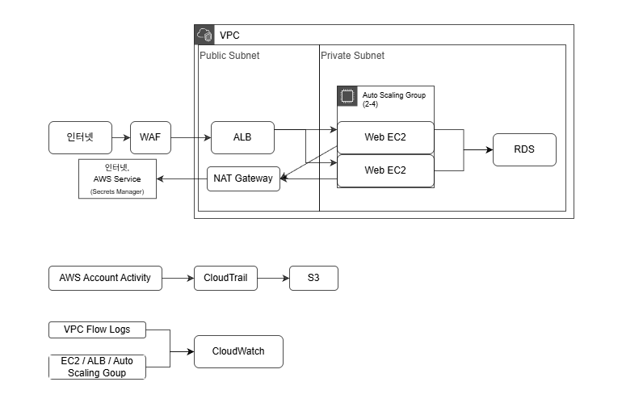

# AWS Cloud Security Infrastructure Lab

## 1. 프로젝트 개요

이 프로젝트는 클라우드 환경에서 웹 서비스를 제공하기 위한 인프라를 구축하고, 네트워크 분리와 접근 제어, 웹 요청 보호, 자격 증명 관리, 로그 및 감사 기능을 함께 적용한 클라우드 보안 인프라 구축 프로젝트이다.

AWS를 대상으로 웹 서비스 운영에 필요한 인프라를 구성한 뒤, 각 네트워크 구간에서 발생할 수 있는 불필요한 노출과 접근을 줄이고, 운영 과정에서 필요한 보안 통제를 적용하는 방향으로 전체 구조를 설계하였다.

## 2. 전체 아키텍처

## 3. 주요 AWS 서비스

| 서비스 | 주요 사용 항목 | 역할 |
| --- | --- | --- |
| VPC | Subnet, IGW, NAT Gateway, Route Table, VPC Flow Logs | 네트워크 분리 및 전체 통신 경로 구성 |
| EC2 | Instance, AMI, Launch Template, ALB, Target Group, Auto Scaling | 가용성을 고려한 웹 서비스 제공 |
| RDS | DB Instance, DB Subnet Group | 웹 서비스용 데이터베이스 제공 |
| IAM | User, Role, Policy | 관리 계정 분리, AWS 리소스 간 접근 권한 제어 |
| Secrets Manager | Secret | DB 자격 증명 등 민감정보 관리 |
| WAF | Web ACL, Managed Rule | 웹 요청 필터링 |
| CloudWatch | Metrics, Logs, Alarm | 리소스 및 로그 모니터링 |
| CloudTrail | Trail | AWS 계정 활동 기록 |
| S3 | Bucket | CloudTrail 감사 로그 보관 |

## 4. 핵심 구성

### 01. 네트워크 분리

> 외부 노출이 필요한 자원과 내부 보호가 필요한 자원을 구분하고, 각 영역에 필요한 통신 경로와 접근 범위를 별도로 적용할 수 있도록 분리된 네트워크로 구성하였다.

- 웹 서비스에 필요한 자원을 외부 노출 여부에 따라 Public Subnet과 Private Subnet으로 분리하였다. 가용성을 위해 Public Subnet과 Private Subnet은 각각 2개씩 구성하여, 두 Availability Zone(AZ)에 하나씩 분산 배치하였다.

- Public Subnet은 Public Route Table을 적용하여 Internet Gateway를 통해 외부 통신이 가능하도록 구성하고, ALB를 배치하여 외부 요청에 응답하도록 하였다.

- Private Subnet에는 Private Route Table을 적용하여 외부에서의 직접 접근이 필요하지 않은 EC2와 RDS를 배치하고, 필요 시 NAT Gateway를 통해 SSM 등 AWS 서비스 및 인터넷과의 아웃바운드 통신이 가능하도록 구성하였다.

- Security Group(SG)을 ALB, Web EC2, RDS에 각각 적용하고, Internet → ALB → Web EC2 → RDS 순서로 서비스 제공에 필요한 통신만 허용하도록 구성하였다.

- VPC Flow Logs를 이용하여 네트워크 트래픽 정보를 수집하도록 구성하였다.

### 02. 웹 서비스 제공

> 웹 서비스를 안정적으로 제공하기 위하여 가용성을 고려한 EC2 기반의 웹 서비스 구성을 적용하였다. 

- EC2 Instance에 웹 서버를 구성하고, HTTP 서비스를 제공하도록 설정하였다. 구성이 완료된 인스턴스를 기반으로 AMI를 생성하였다.

- AMI를 Launch Template에 적용하여 동일한 구성의 EC2 Instance를 반복적으로 생성할 수 있도록 구성하였다.

- Application Load Balancer(ALB)와 Target Group을 구성하여 외부 HTTP 요청을 정상 상태의 EC2 Instance로 분산하도록 구성하였다.

- Auto Scaling Group은 두 Private Subnet을 대상으로 구성하여 서로 다른 AZ에 웹 서버 EC2 Instance를 분산 배치하도록 하였으며, 설정한 용량을 유지하고 부하에 따라 인스턴스 수가 증감되도록 구성하였다.

### 03. 데이터베이스 보호

> 데이터베이스는 외부 노출과 불필요한 접근을 최소화하고, 필요한 웹 서버에서만 안전하게 접근할 수 있도록 구성하였다.

- RDS를 이용하여 웹 서비스용 데이터베이스를 구성하고, Publicly Accessible 옵션을 비활성화하여 외부에서 직접 접근할 수 없도록 구성하였다.

- RDS Security Group은 Web Security Group에서 전달되는 TCP 3306 연결만 허용하도록 구성하였다.

- Web EC2는 데이터베이스 접속에 필요한 정보를 인스턴스 내부에 직접 저장하지 않도록 구성하였다.

### 04. 권한 및 자격 증명 관리

> AWS 리소스 간 접근 권한을 역할별로 제한하고, 데이터베이스 자격 증명은 Secrets Manager를 통해 별도로 관리하도록 구성하였다.

- 관리용 IAM User를 별도로 생성하여 루트 계정의 상시 사용을 피하고, 생성 이후 해당 계정을 이용해 관리 작업을 수행하였다.  

- IAM Role과 Policy를 생성하여 VPC Flow Logs의 로그 전달과 EC2의 AWS 서비스 접근에 필요한 권한을 각각 부여하였다.  

- Secrets Manager에 RDS 접속에 필요한 자격 증명을 저장하고, EC2가 IAM Role 권한으로 해당 Secret을 조회하여 RDS 연결에 사용하도록 구성하였다.

### 05. 웹 요청 보호

> 외부의 웹 요청에 대해 애플리케이션 계층의 보안 통제를 적용할 수 있도록 웹 방화벽을 구성하였다.

- WAF를 ALB에 연결하고 Web ACL을 적용하여 외부 웹 요청을 검사하도록 구성하였다.

- AWS Managed Rules의 Common Rule Set과 SQL Injection Rule Set을 적용하여 일반적인 웹 공격 및 SQL Injection 패턴을 탐지·차단하도록 구성하였다.

### 06. 모니터링 및 감사

> AWS 리소스의 상태와 네트워크 통신, 계정 활동을 기록하고 확인할 수 있도록 모니터링 및 감사 체계를 구성하였다.

- CloudTrail을 이용하여 AWS 계정에서 수행된 주요 작업과 변경 이력을 기록하고, 생성된 감사 로그를 S3 Bucket에 저장하도록 구성하였다.

- VPC Flow Logs를 통해 네트워크 트래픽 정보를 수집하고 CloudWatch에서 확인할 수 있도록 구성하였다.

- CloudWatch를 이용하여 주요 리소스의 상태와 메트릭을 확인하고, 수집된 로그를 통합적으로 모니터링할 수 있도록 구성하였다.

## 5. 검증

구성한 인프라와 보안 기능이 의도한 대로 동작하는지 확인하기 위해 웹 서비스 접근 및 부하분산, RDS 연결, WAF 차단, 로그 및 감사 기록, Auto Scaling 동작을 검증하였다.

상세한 검증 과정과 결과는 [08. 검증 결과](./docs/08_검증_결과.md)에서 확인할 수 있다.

## 6. 상세 문서

프로젝트에서 사용된 리소스별 세부 구성 내용은 아래 문서에서 확인할 수 있다.

- [01. VPC](./docs/01_VPC.md)
- [02. EC2](./docs/02_EC2.md)
- [03. RDS](./docs/03_RDS.md)
- [04. IAM 및 Secrets Manager](./docs/04_IAM_SecretsManager.md)
- [05. WAF](./docs/05_WAF.md)
- [06. CloudWatch](./docs/06_CloudWatch.md)
- [07. CloudTrail 및 S3](./docs/07_CloudTrail_S3.md)
- [08. 검증 결과](./docs/08_검증_결과.md)
