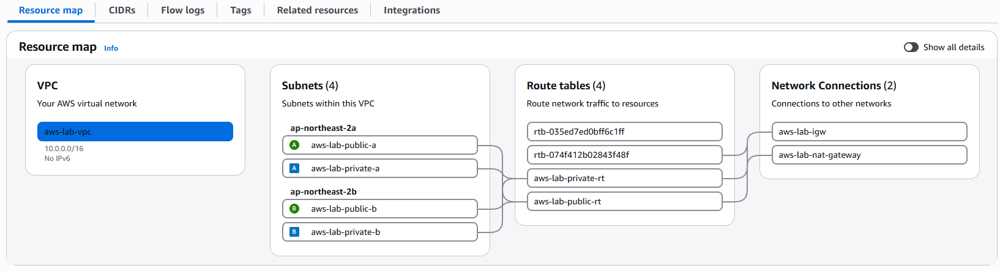

# 01. VPC 세부 

## 1. VPC 구성

- 프로젝트 Region은 Asia Pacific (Seoul)로 설정하였다.
- VPC CIDR은 `10.0.0.0/16`으로 구성하였다.

## 2. Subnet 구성

- 외부에서의 직접 접근 필요 여부를 기준으로 리소스를 분리 배치하기 위해 Public Subnet과 Private Subnet을 구성하였다.
- Public Subnet과 Private Subnet을 각각 2개씩 구성하고, 두 Availability Zone(2a, 2b)에 하나씩 분산 배치하였다.

| Subnet | CIDR | AZ | Route Table | 배치 리소스 |
| --- | --- | --- | --- | --- |
| Public Subnet a | `10.0.1.0/24` | ap-northeast-2a | public rt | ALB |
| Public Subnet b | `10.0.4.0/24` | ap-northeast-2b | public rt | ALB |
| Private Subnet a | `10.0.2.0/24` | ap-northeast-2a | private rt | EC2 Web |
| Private Subnet b | `10.0.3.0/24` | ap-northeast-2b | private rt | EC2 Web |

## 3. Internet Gateway

- Internet Gateway(IGW)를 생성하여 Public Subnet의 인터넷 통신을 위한 게이트웨이로 구성하였다.

## 4. Route Table

- Public Route Table과 Private Route Table로 구성하였다.
- Public Route Table은 `10.0.0.0/16 → local`과 `0.0.0.0/0 → IGW`를 경로로 구성하여 Public Subnet에 연결하였다.
- Private Route Table은 `10.0.0.0/16 → local`과 `0.0.0.0/0 → NAT Gateway`를 경로로 구성하여 Private Subnet에 연결하였다.

## 5. NAT Gateway

- NAT Gateway를 통해 Private Subnet의 EC2가 외부 인터넷 및 AWS 서비스(SSM, Secrets Manager)에 아웃바운드로 접근할 수 있도록 구성하였다.

## 6. Security Group

- Security Group(SG)을 ALB, Web EC2, RDS에 각각 적용하여 리소스별 접근 범위를 분리하였다.

| Security Group | Inbound | Source | 적용 대상 |
| --- | --- | --- | --- |
| ALB SG | HTTP 80 | `0.0.0.0/0` | ALB |
| Web SG | HTTP 80 | ALB SG | EC2 Web |
| RDS SG | TCP 3306 | Web SG | RDS |

- 외부 HTTP 요청은 ALB에서만 허용하고, Web EC2는 ALB를 통해 전달되는 요청만 받을 수 있도록 구성하였다.
- RDS는 Web EC2에서 전달되는 TCP 3306 연결만 허용하도록 구성하였다.

## 7. VPC Flow Logs

- VPC Flow Logs를 활성화하여 VPC의 네트워크 트래픽 정보를 수집하도록 구성하였다.

- 수집된 Flow Logs는 CloudWatch Logs로 전송하여 네트워크 통신 내역을 확인할 수 있도록 구성하였다.

## 8. 대표 화면

