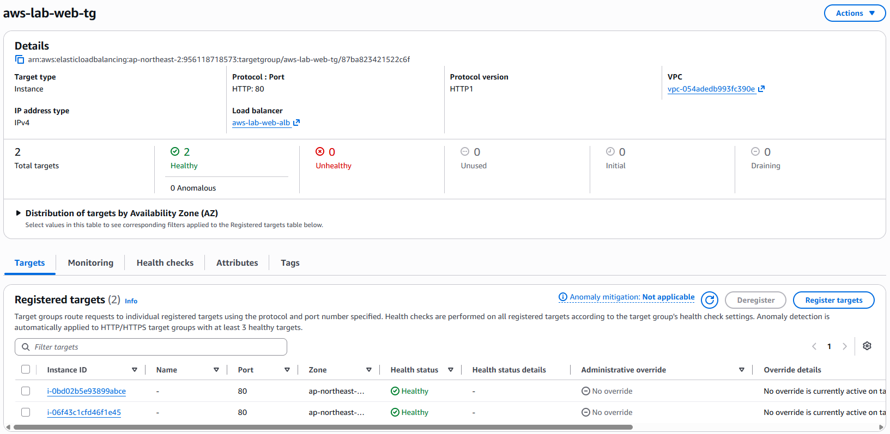
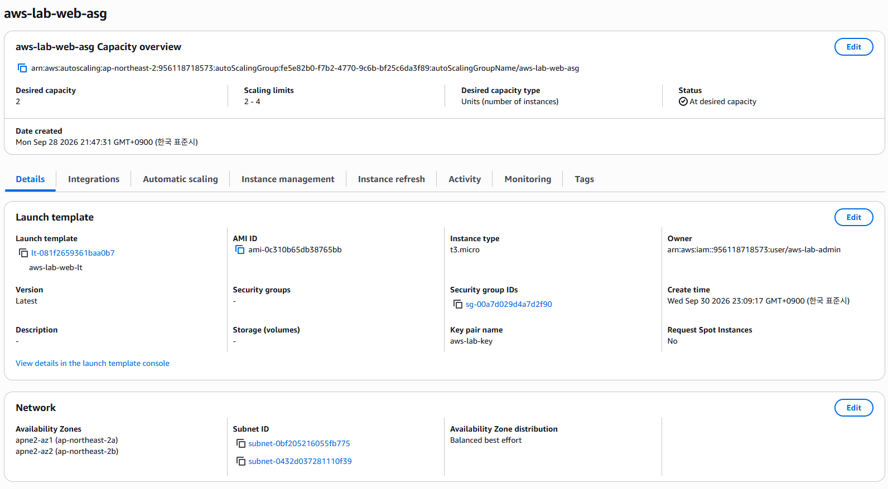
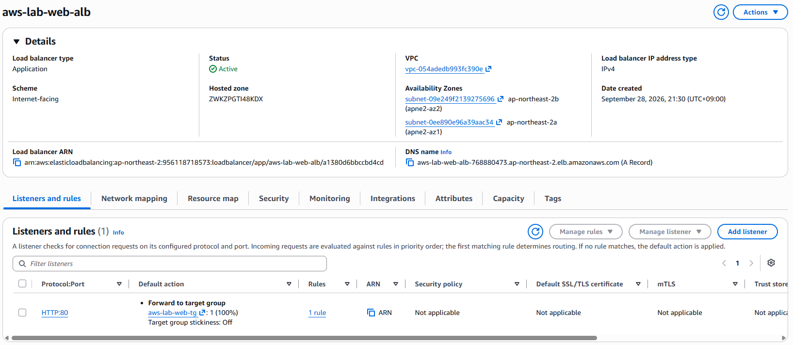

# 02 EC2 

## 1. EC2 Instance 구성

EC2의 구성 환경은 다음과 같다.

| 항목 | 설정 |
| --- | --- |
| OS / AMI | Amazon Linux 2023 kernel-6.18 AMI |
| Instance Type | t3.micro |
| Subnet | Private Subnet |
| Security Group | Web SG |
| IAM Role | EC2용 IAM Role |
| Web Server | Apache(httpd) |
| Service Port | HTTP 80 |
| 관리 접근 | Systems Manager Session Manager |

## 2. Launch Template

- 웹 서버 구성이 완료된 EC2 Instance를 기반으로 AMI를 생성하였다.
- 생성한 AMI를 Launch Template에 적용하여 동일한 구성의 EC2 Instance를 생성할 수 있도록 구성하였다.
- User Data를 이용하여 EC2 Instance의 Hostname을 웹 페이지에 출력하도록 구성하고, ALB의 요청 분산 여부를 확인할 수 있도록 하였다.

    `#!/bin/bash
echo "AWS LAB Web Server - $HOSTNAME" > /var/www/html/index.html`

## 3. Load Balancing

- Application Load Balancer(ALB)를 생성하여 외부 HTTP 요청을 Target Group으로 전달하도록 구성하였다.

- Target Group은 EC2 Instance를 대상으로 HTTP:80 포트로 구성하고, Health Check를 통해 정상 상태의 인스턴스만 요청을 전달받도록 설정하였다.

- ALB Listener는 HTTP:80으로 설정하고, 연결된 Target Group으로 요청을 전달하도록 구성하였다.

- ALB는 두 Public Subnet에 연결하여 서로 다른 AZ에서 외부 요청을 처리할 수 있도록 구성하였다.

## 4. Auto Scaling Group

- Launch Template을 기반으로 Web EC2 Instance를 자동 생성하도록 Auto Scaling Group을 구성하였다.

- 두 Private Subnet을 대상으로 설정하여 서로 다른 Availability Zone에 EC2 Instance가 분산 배치되도록 구성하였다.

- 최소 용량 2, 희망 용량 2, 최대 용량 4로 설정하고, CPU 사용률을 기준으로 인스턴스 수가 자동으로 증감되도록 Scaling Policy를 적용하였다.

- 생성된 EC2 Instance는 Target Group에 자동 등록되어 ALB를 통해 트래픽을 전달받도록 구성하였다.

## 5. 대표 화면

### Target Group 상태

### Auto Scaling Group 상태

### Load Balancer 구성

