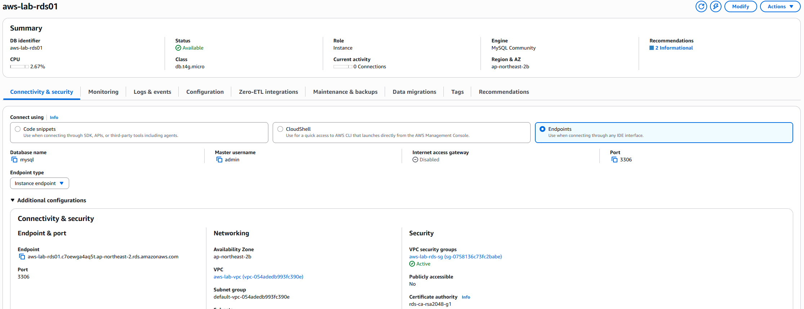

# 03 RDS

## 1. RDS 구성

웹 서비스에서 사용할 데이터베이스 제공을 위해 Amazon RDS for MySQL을 구성하였다.

| 항목 | 설정 |
| --- | --- |
| Engine | MySQL Community |
| DB Instance Class | db.t4g.micro |
| Port | TCP 3306 |
| Publicly Accessible | No |
| Security Group | RDS SG |
| Availability Zone | ap-northeast-2b |

## 2. 네트워크 및 접근 제어

- RDS는 프로젝트 VPC 내부에 구성하고, Publicly Accessible 옵션을 비활성화하여 외부에서 직접 접근할 수 없도록 설정하였다.

- RDS Security Group은 Web SG에서 전달되는 TCP 3306 통신만 허용하도록 구성하였다.

- 이를 통해 데이터베이스에 대한 접근 경로를 Web EC2 Instance로 제한하였다.

## 3. EC2 연동

- Web EC2 Instance에서 RDS의 MySQL 데이터베이스에 접근하도록 구성하였다.

- 데이터베이스 자격 증명은 EC2 내부에 직접 저장하지 않고 Secrets Manager를 통해 관리하도록 구성하였다.

- EC2는 IAM Role을 이용하여 Secrets Manager의 자격 증명을 조회한 후 RDS 연결에 사용할 수 있도록 구성하였다.

## 4. 대표 화면

### RDS Connectivity & Security

