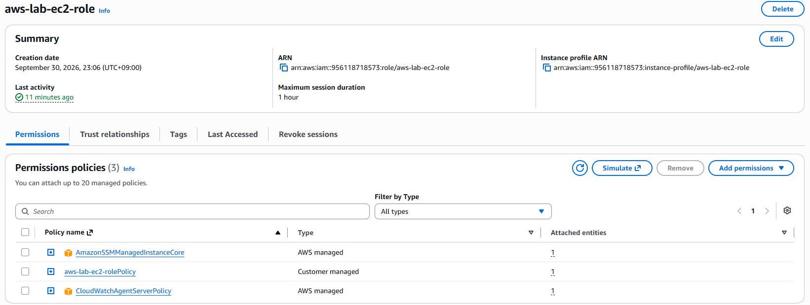
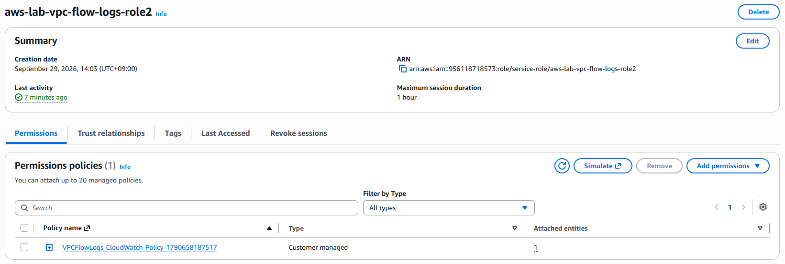

# 04 IAM 및 Secrets Manager

## 1. IAM User

- AWS 관리 작업을 위해 별도의 IAM User를 생성하여 사용하였다.

- 일상적인 관리 작업은 Root 계정 대신 IAM User를 통해 수행하였다.

## 2. EC2 IAM Role

- Web EC2 Instance가 AWS Systems Manager Session Manager를 사용할 수 있도록 관련 권한을 부여하였다.

- EC2 Instance가 Secrets Manager에 저장된 RDS 자격 증명을 조회할 수 있도록 필요한 권한을 추가하였다.

- 이를 통해 EC2 관리 접근과 데이터베이스 자격 증명 조회를 IAM Role 기반으로 수행하도록 구성하였다.

## 3. VPC Flow Logs IAM Role

- VPC Flow Logs가 수집한 네트워크 트래픽 정보를 CloudWatch Logs로 전달할 수 있도록 IAM Role을 구성하였다.

- 해당 Role에는 Flow Logs가 CloudWatch Logs에 로그를 생성하고 기록하는 데 필요한 권한을 부여하였다.

## 4. Secrets Manager

- RDS 접속에 필요한 데이터베이스 자격 증명을 Secrets Manager에 저장하였다.

- Web EC2 Instance는 IAM Role에 부여된 권한을 이용하여 해당 Secret을 조회하도록 구성하였다.

- 이를 통해 데이터베이스 자격 증명을 EC2 내부에 직접 저장하지 않고 별도로 관리하도록 구성하였다.

## 5. EC2 및 RDS 연동

- Web EC2 Instance에서 Secrets Manager에 저장된 데이터베이스 자격 증명을 조회하도록 구성하였다.

- 조회한 자격 증명을 이용하여 RDS의 MySQL 데이터베이스에 접근할 수 있도록 구성하였다.

## 6. 대표 화면

### EC2 IAM Role

### VPC Flow Logs Role

