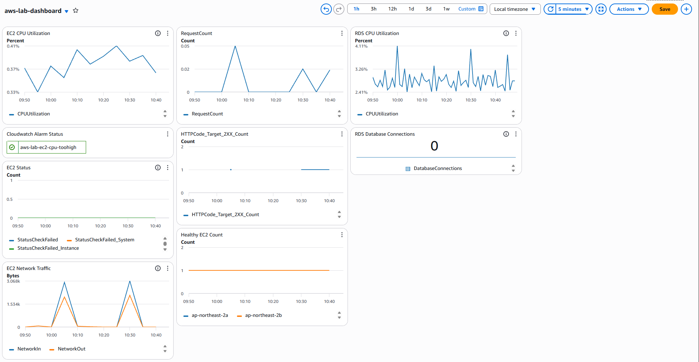

# 06 CloudWatch

## 1. CloudWatch 구성

- AWS 리소스의 상태와 성능을 확인하고, 수집된 로그를 통합적으로 확인하기 위해 CloudWatch를 구성하였다.

- EC2, Auto Scaling Group, Application Load Balancer 등 주요 리소스의 Metrics를 확인할 수 있도록 구성하였다.

## 2. Metrics

- EC2 Instance의 CPU 사용률 등 주요 Metrics를 CloudWatch에서 확인할 수 있도록 구성하였다.

- Auto Scaling Group의 Scaling Policy에서 EC2 CPU 사용률을 기준으로 인스턴스 수가 자동으로 증감되도록 설정하였다.

- Application Load Balancer와 Target Group의 상태 관련 Metrics도 CloudWatch를 통해 확인할 수 있도록 구성하였다.

## 3. CloudWatch Logs

- VPC Flow Logs를 CloudWatch Logs로 전달하여 VPC 내부 네트워크 통신 정보를 확인할 수 있도록 구성하였다.

- 이를 통해 출발지 및 목적지 주소, 포트, 통신 허용 여부 등의 네트워크 흐름을 확인할 수 있도록 하였다.

## 4. Alarm 및 Auto Scaling 연동

- Auto Scaling Group의 Scaling Policy와 CloudWatch Metrics를 연계하여 CPU 사용률에 따라 EC2 Instance 수가 자동으로 조정되도록 구성하였다.

- 이를 통해 웹 서버의 부하 변화에 따라 필요한 인스턴스 수를 동적으로 유지할 수 있도록 하였다.

## 5. 대표 화면

### Dashboard 화면

