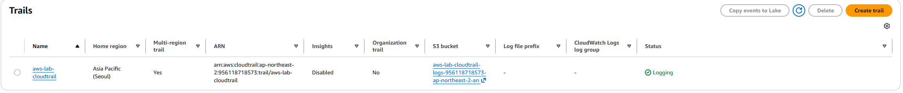
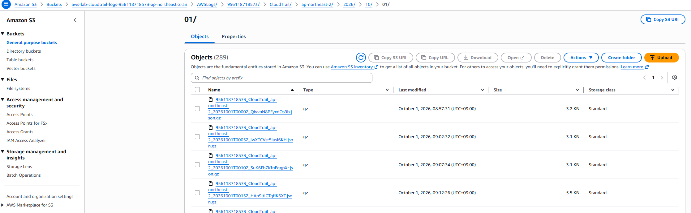

# 07 CloudTrail 및 S3

## 1. CloudTrail 구성

- AWS 계정에서 발생하는 주요 관리 작업과 API 호출 이력을 기록하기 위해 CloudTrail을 구성하였다.

- Trail을 생성하여 리소스 생성, 수정, 삭제 등 AWS Management Event를 기록하도록 설정하였다.

## 2. S3 로그 저장

- CloudTrail에서 수집한 감사 로그를 별도의 S3 Bucket에 저장하도록 구성하였다.

- 이를 통해 AWS 계정 활동 이력을 장기간 보관하고 필요한 경우 추적할 수 있도록 하였다.

## 3. 감사 로그 확인

- CloudTrail Event history를 통해 AWS 리소스에 대한 관리 작업 기록을 확인할 수 있도록 구성하였다.

- 기록된 CloudTrail 로그가 S3 Bucket에 저장되는 것을 확인할 수 있도록 구성하였다.

## 4. 대표 화면

### CloudTrail

### S3
