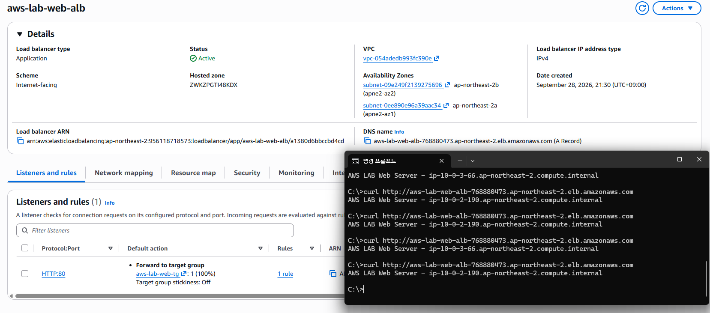
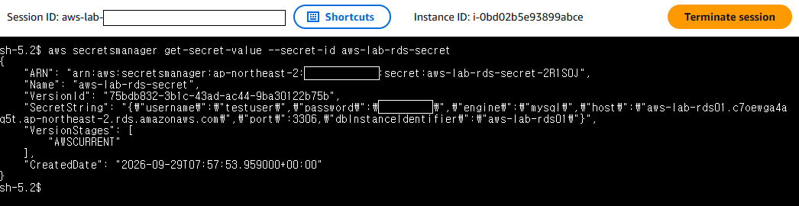
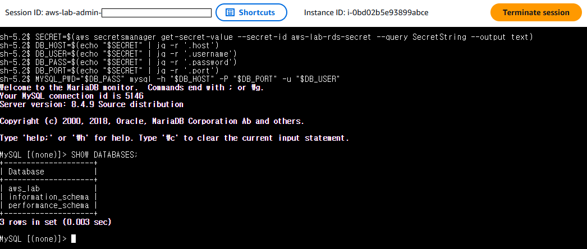
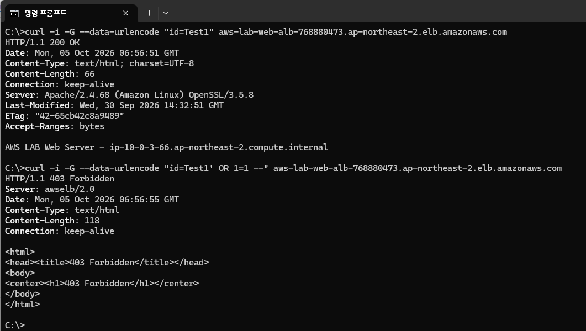
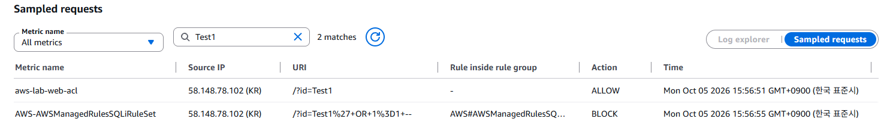
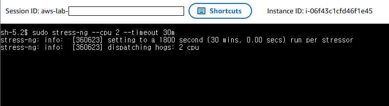
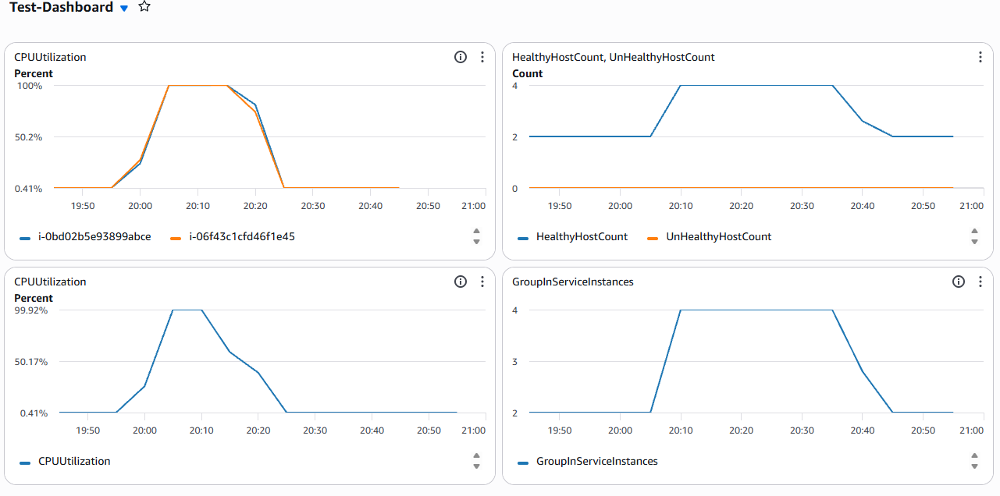
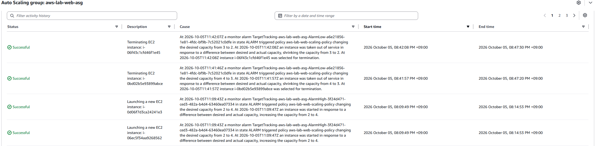

# 08 검증 결과

## 1. 외부 접속 및 Load Balancing 검증
외부 환경에서 ALB의 DNS 주소로 HTTP 요청을 반복하여 전송하였다.

요청 결과 서로 다른 EC2 Instance의 hostname이 번갈아 응답되는 것을 확인하였으며, ALB가 Target Group에 등록된 Web EC2 Instance로 요청을 정상적으로 분산하고 있음을 확인하였다.



## 2. RDS 및 Secrets Manager 연동 검증

Web EC2 Instance에서 IAM Role 권한을 이용하여 Secrets Manager의 RDS 자격 증명을 조회하였다.

```bash
aws secretsmanager get-secret-value --secret-id aws-lab-rds-secret
```



조회한 Secret에서 데이터베이스 접속 정보를 추출한 후 해당 값을 이용하여 RDS MySQL에 접속하고, 데이터베이스 목록을 조회하여 정상적인 연동을 확인하였다.

```bash
SECRET=$(aws secretsmanager get-secret-value --secret-id aws-lab-rds-secret --query SecretString --output text)
DB_HOST=$(echo "$SECRET" | jq -r '.host')
DB_USER=$(echo "$SECRET" | jq -r '.username')
DB_PASS=$(echo "$SECRET" | jq -r '.password')
DB_PORT=$(echo "$SECRET" | jq -r '.port')
MYSQL_PWD="$DB_PASS" mysql -h "$DB_HOST" -P "$DB_PORT" -u "$DB_USER"
```

```sql
SHOW DATABASES;
```




## 3. WAF 차단 및 모니터링 검증

정상 HTTP 요청과 SQL Injection 형태의 요청을 각각 전송하여 WAF의 동작을 확인하였다.

정상 요청은 `HTTP 200 OK`로 처리되었으며, SQL Injection 형태의 요청은 `HTTP 403 Forbidden`으로 차단되었다.

```bash
curl -i -G --data-urlencode "id=Test1" aws-lab-web-alb-768880473.ap-northeast-2.elb.amazonaws.com

curl -i -G --data-urlencode "id=Test1' OR 1=1 --" aws-lab-web-alb-768880473.ap-northeast-2.elb.amazonaws.com
```




WAF의 Sampled requests에서 동일한 요청을 확인한 결과, 정상 요청은 ALLOW, SQL Injection 형태의 요청은 AWSManagedRulesSQLiRuleSet에 의해 BLOCK 처리된 것을 확인하였다.




## 4. Auto Scaling 및 CloudWatch 검증

Web EC2 Instance에 CPU 부하를 발생시켜 Auto Scaling Group의 Scale-out 동작을 확인하였다.


```bash
stress-ng --cpu 2 --timeout 30m
```

두 Web EC2 Instance에 CPU 부하를 발생시켜 높은 CPU 사용률이 지속되도록 하였다.


CloudWatch에서 기존 EC2 Instance의 CPU Utilization이 상승하는 것을 확인하였다. 이후 Scaling Policy가 동작하면서 In Service Instance와 Healthy Host 수가 2개에서 4개로 증가하였으며, 부하 종료 후 다시 2개로 감소하였다.


Auto Scaling Group의 Activity history에서 Scaling Policy에 의해 Desired Capacity가 2에서 4로 증가하면서 신규 EC2 Instance가 생성되고, 이후 부하 감소에 따라 4에서 3, 3에서 2로 Scale-in이 수행된 것을 확인하였다.


